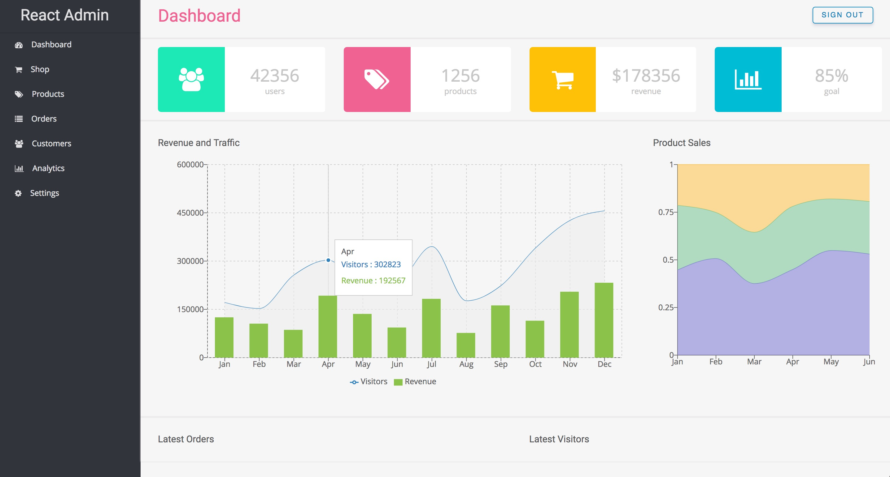

# React Admin Dashboard

## Available Scripts

- In the project directory, you can run: `npm install` or `yarn install`
- Run `npm start` or `yarn start`
- Open [http://localhost:3000](http://localhost:3000) to view it in the browser
- To watch for changes in SCSS files, run `npm watch-css` or `yarn watch-css`

## Dependencies

- [Create React App](https://github.com/facebookincubator/create-react-app)
- [React Redux](https://github.com/reactjs/redux)
- [React Router](https://github.com/ReactTraining/react-router)
- [Redux Form](http://redux-form.com/)
- [Firebase](https://firebase.google.com/)
- [Semantic UI React](https://react.semantic-ui.com)
- [Recharts](http://recharts.org/#/en-US/)

